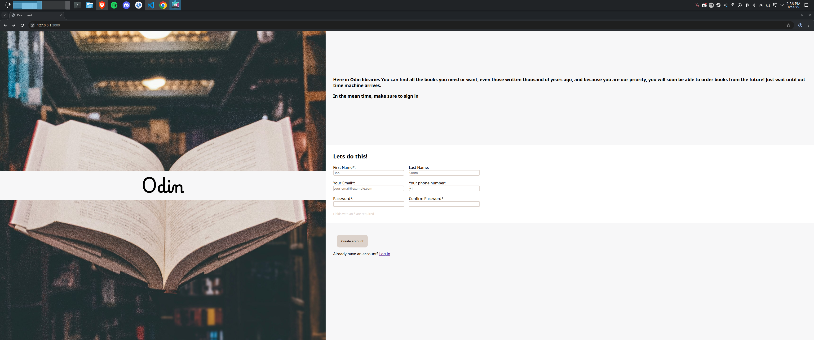
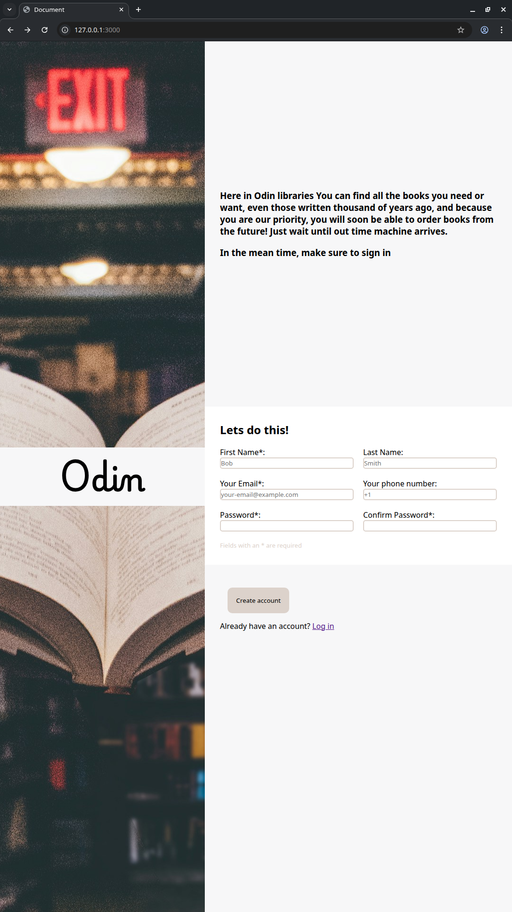

# Forms

This project is part of [the odin project](https://www.theodinproject.com/) and was created for educational purposes only

The project I was instructed to create:

There is no image available for a mobile or smaller screens, so I had to improvise, 3the following are my results (not finals)

## Screenshots

Here are some screenshots

### On desktop, 2k resolution

### On desktop, vertical

### On tablet

(Pending for live site)

### On mobile

(Pending for live site)

## Thanks

Remember to check the live site
